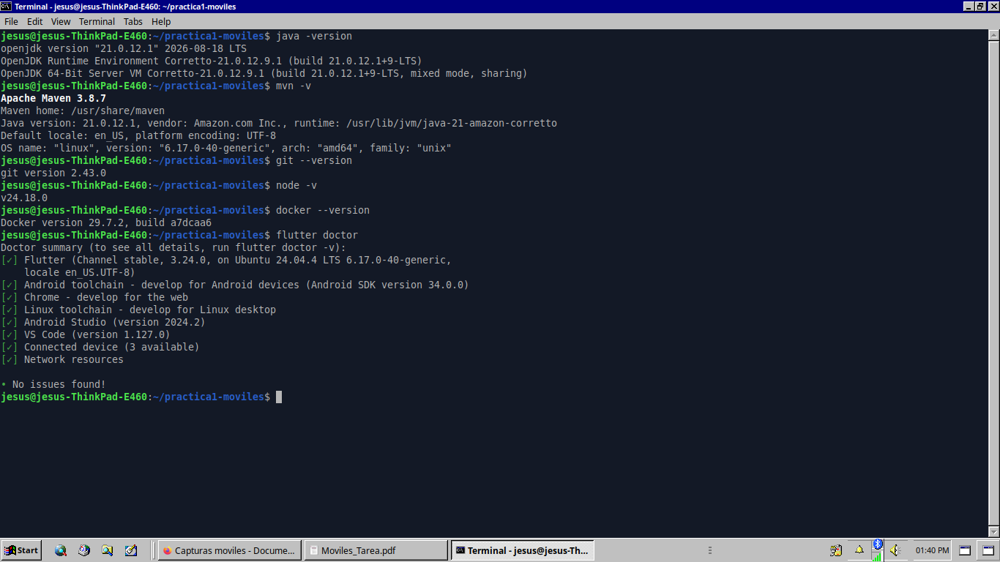
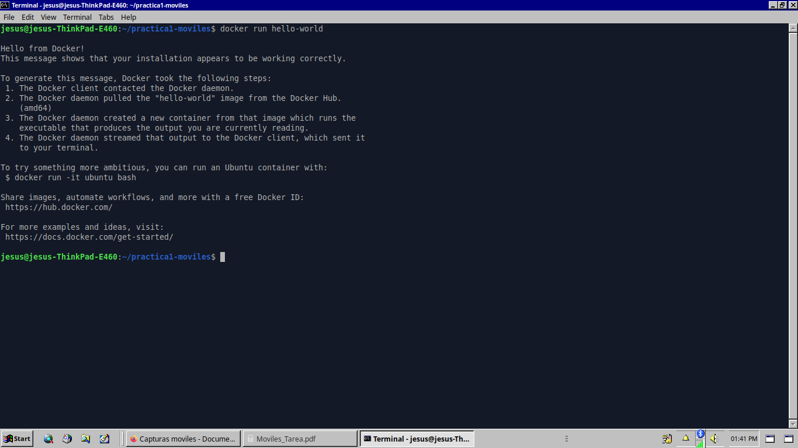
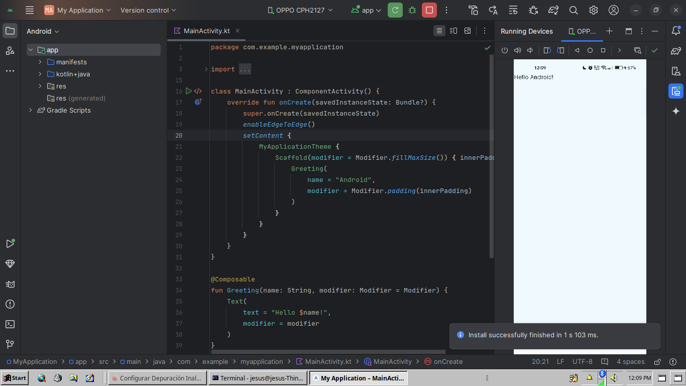
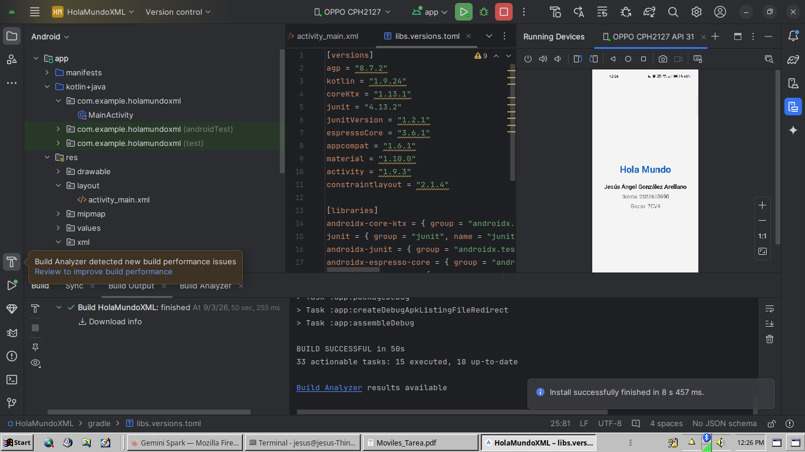
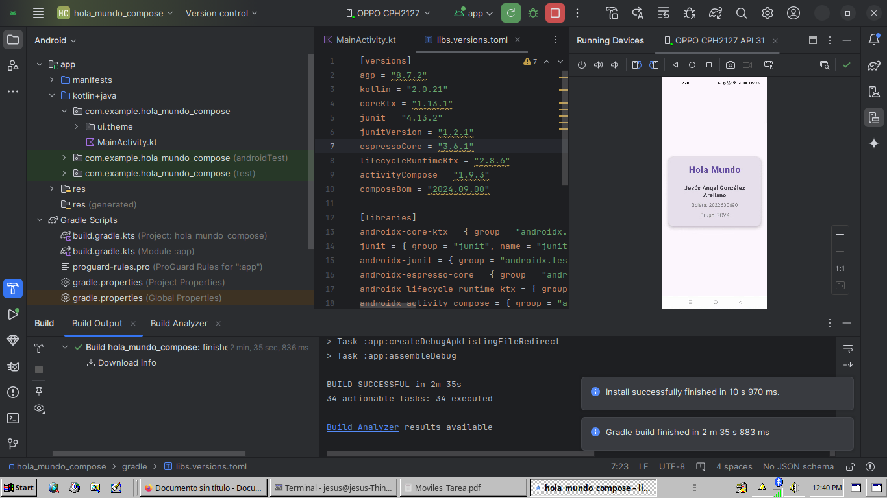
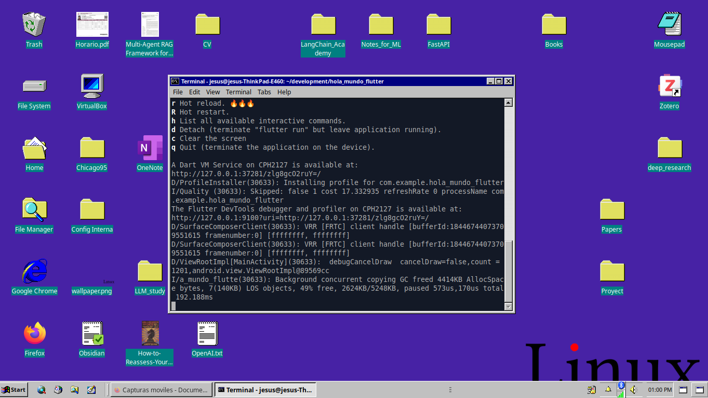
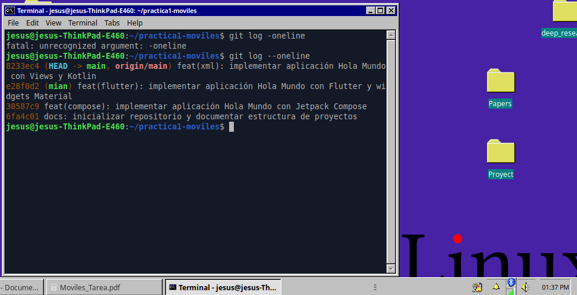

# Instituto Politécnico Nacional
## Escuela Superior de Cómputo

**Programa Académico:** Ingeniería en Sistemas Computacionales 

**Unidad de Aprendizaje:** Desarrollo de aplicaciones móviles nativas 

**Grupo:** 7CV4 

**Periodo Escolar:** 2027-1 

**Profesor:** Gabriel Hurtado Avilés 


### Práctica 1: Instalación y Funcionamiento de los Entornos Móviles

**Alumno:** Jesús Ángel González Arellano 
**Boleta:** 2022630690 
**Fecha:** 03 de septiembre de 2026 

---

## 1. Introducción

El desarrollo de software para dispositivos móviles ha evolucionado desde interfaces construidas de forma puramente imperativa hasta arquitecturas declarativas y reactivas. Para abordar proyectos en el ecosistema Android, resulta fundamental contar con un entorno de desarrollo integrado que contemple la compilación de lenguajes modernos (Kotlin y Dart), la gestión de dependencias automatizadas (Gradle y Maven), el control de versiones local y remoto (Git y GitHub) y herramientas de virtualización y contenedores (Docker).

Esta práctica documenta el proceso formal de instalación y validación de las herramientas requeridas sobre un entorno Linux nativo, así como el desarrollo comparativo de una aplicación básica implementada bajo tres tecnologías fundamentales: Views tradicionales con XML, Jetpack Compose y Flutter.

---

## 2. Objetivos y Planteamiento del Problema

### 2.1 Objetivo General
Instalar, configurar y verificar el funcionamiento del entorno de desarrollo necesario para la construcción de aplicaciones móviles nativas, desarrollando y publicando en GitHub tres versiones de una aplicación básica para comparar de forma analítica los enfoques de construcción de interfaces de usuario.

### 2.2 Planteamiento del Problema
Cada una de las aplicaciones debe presentar en pantalla la siguiente información obligatoria:
- Texto principal: "Hola Mundo"
- Nombre completo del alumno: Jesús Ángel González Arellano
- Número de boleta: 2022630690
- Grupo: 7CV4

---

## 3. Estructura del Repositorio

El código fuente se encuentra organizado en carpetas independientes, cada una con su configuración y archivos de compilación propios:

```text
practica1-entornos-moviles/
├── README.md               # Documentación principal de la práctica
├── img/                    # Evidencias fotográficas incrustadas en el reporte
├── hola_mundo_xml/         # Versión 1: Android nativo con Views en XML y Kotlin
├── hola_mundo_compose/     # Versión 2: Android nativo con Jetpack Compose en Kotlin
└── hola_mundo_flutter/     # Versión 3: Multiplataforma con Flutter y Dart

```

---

## 4. Desarrollo de la Práctica

### 4.1 Ejercicio 1: Instalación y Verificación de Herramientas

Las herramientas fueron instaladas y validadas sobre un equipo portátil Lenovo ThinkPad E460 con arquitectura x86_64:

| Herramienta | Versión Instalada | Comando de Comprobación | Sistema Operativo / Entorno |
| --- | --- | --- | --- |
| Android Studio | Ladybug 2024.2.1 Patch 2 | Ayuda > Acerca de | Linux Ubuntu 24.04.4 LTS |
| Java JDK (Corretto) | OpenJDK 21.0.12.1 LTS | java -version | Linux Ubuntu 24.04.4 LTS |
| Apache Maven | 3.8.7 | mvn -v | Linux Ubuntu 24.04.4 LTS |
| Git | 2.43.0 | git --version | Linux Ubuntu 24.04.4 LTS |
| Node.js | v24.18.0 | node -v | Linux Ubuntu 24.04.4 LTS |
| Docker Engine | 29.7.2, build a7dcaa6 | docker --version | Linux Ubuntu 24.04.4 LTS |
| Flutter SDK | 3.24.0 (Channel stable) | flutter doctor | Linux Ubuntu 24.04.4 LTS |

#### Verificación de Versiones en Terminal

Se comprobó la disponibilidad de cada binario y se ejecutó la herramienta de diagnóstico de Flutter (`flutter doctor`), validando que las cadenas de desarrollo para Android, Linux Desktop y Web se encuentran completamente configuradas:



#### Verificación de Contenedor Docker

Se ejecutó la imagen de prueba `hello-world` para corroborar la correcta comunicación con el demonio de Docker y el aislamiento de procesos:




#### Ejecución de la Aplicación Base "Hello Android"

Se validó la cadena de compilación de Android Studio mediante el despliegue de una aplicación inicial sobre el dispositivo físico OPPO CPH2127 (API 31):



---

### 4.2 Ejercicio 2: Construcción de la Aplicación en Tres Enfoques

#### Versión 1: Android Nativo con Views (XML)

* Directorio: `hola_mundo_xml`
* Descripción Técnica: Implementación clásica basada en un archivo de layout XML (`activity_main.xml`) utilizando un contenedor `LinearLayout` con orientación vertical y alineación centrada. En la actividad (`MainActivity.kt`) se realiza el inflado de la vista y se aplica el soporte de pantalla completa (*Edge-to-Edge*):



#### Versión 2: Android Nativo con Jetpack Compose

* Directorio: `hola_mundo_compose`
* Descripción Técnica: Implementación declarativa nativa mediante Kotlin. Se programó la función composable personalizada `StudentInfoCard`, encapsulando un contenedor `Card` con bordes redondeados y sombra sobre una superficie `Surface`. La vista cuenta con soporte para renderizado en el editor mediante la anotación `@Preview`:




#### Versión 3: Multiplataforma con Flutter

* Directorio: `hola_mundo_flutter`
* Descripción Técnica: Implementación reactiva multiplataforma en lenguaje Dart. La estructura se compone de un árbol de widgets con `MaterialApp`, `Scaffold`, `AppBar`, `Card` y `Column`, compilada directamente hacia el dispositivo físico vía depuración USB:




### 4.3 Control de Versiones e Historial de Commits

El trabajo fue versionado de manera incremental con mensajes semánticos para cada tecnología:



---

## 5. Instrucciones de Ejecución de los Proyectos

### A. Ejecutar Versión 1 (Views con XML)

1. Abrir la carpeta `hola_mundo_xml` en Android Studio.
2. Esperar la sincronización de dependencias de Gradle.
3. Conectar el dispositivo Android o encender el emulador y presionar el botón **Run** (o ejecutar `./gradlew installDebug`).

### B. Ejecutar Versión 2 (Jetpack Compose)

1. Abrir la carpeta `hola_mundo_compose` en Android Studio.
2. Verificar la interfaz mediante la vista previa `@Preview` en el IDE o compilar al dispositivo mediante el botón **Run**.

### C. Ejecutar Versión 3 (Flutter)

1. Abrir una terminal y posicionarse en la carpeta:
```bash
cd hola_mundo_flutter

```


2. Comprobar la detección del dispositivo:
```bash
flutter devices

```


3. Ejecutar la aplicación:
```bash
flutter run

```


---

## 6. Dificultades Encontradas y Soluciones Técnicas

1. **Incompatibilidad de dependencias AAR en Android Studio:**
* Problema: Las plantillas por defecto incluyeron versiones preview de AndroidX (`core-ktx 1.19.0`, `activity 1.13.0`) que requerían una versión de Android SDK superior (API 36/37) a la instalada.
* Solución: Se estabilizó el archivo de versiones `gradle/libs.versions.toml` fijando librerías probadas y compatibles con Android 34 (`coreKtx = "1.13.1"`, `activity = "1.9.3"`).


2. **Incompatibilidad de Gradle con Java 21 en Flutter:**
* Problema: El comando `flutter run` falló debido a que la versión de Java activa (Amazon Corretto 21) requiere Gradle 8.5 o superior, mientras que el proyecto base traía una versión inferior.
* Solución: Se actualizó la directiva `distributionUrl` en `android/gradle/wrapper/gradle-wrapper.properties` a la versión `gradle-8.7-all.zip`.


3. **Restricción de memoria RAM (8 GB) en el equipo de desarrollo:**
* Problema: Levantar un emulador virtual AVD junto con Android Studio saturaba la memoria RAM de la laptop.
* Solución: Se configuró el despliegue directo sobre el dispositivo físico Android (**OPPO CPH2127**) mediante depuración USB (`adb`), eliminando la sobrecarga de virtualización en el sistema operativo.


---

## 7. Conclusiones

Al desarrollar la misma aplicación en las tres tecnologías, se identifican diferencias claras en la forma de trabajar:

* **Views con XML:** Es el método tradicional de Android. Aunque es funcional y ampliamente usado en proyectos antiguos, resulta más tardado porque obliga a diseñar la pantalla en un archivo XML y programar el comportamiento en otro archivo de Kotlin, lo que genera más código y pasos adicionales para conectar los elementos.
* **Jetpack Compose:** Es la forma moderna de desarrollar para Android. Resulta mucho más cómodo y rápido porque todo se programa directamente en Kotlin. Permite crear pantallas con mucho menos código y ver los cambios visuales al instante dentro de Android Studio sin necesidad de compilar todo el proyecto.
* **Flutter:** Es la alternativa más versátil si el objetivo es crear una aplicación que funcione tanto en Android como en iOS con un solo código. Su herramienta de recarga rápida (*Hot Reload*) hace que diseñar y corregir la interfaz sea muy ágil, convirtiéndolo en una opción práctica y eficiente.

**En conclusión:**

El uso de Views con XML sirve para entender las bases históricas de Android, pero **Jetpack Compose y Flutter** representan el estándar actual: son herramientas mucho más amigables, reducen el trabajo repetitivo y permiten construir interfaces de forma más rápida y ordenada.

---

## 8. Referencias

1. Android Developers. (2024). *Build a basic layout with Views*. Google Developers. Recuperado de: https://developer.android.com/develop/ui/views/layout/declaring-layout
2. Android Developers. (2024). *Jetpack Compose basics*. Google Developers. Recuperado de: https://developer.android.com/develop/ui/compose/tutorial
3. Flutter Documentation. (2024). *Building layouts in Flutter*. Flutter Dev. Recuperado de: https://docs.flutter.dev/ui/layout
4. Docker Documentation. (2024). *Docker Engine overview*. Docker Docs. Recuperado de: https://docs.docker.com/engine/
5. Gradle User Manual. (2024). *Compatibility Matrix for Java and Gradle*. Gradle Inc. Recuperado de: https://docs.gradle.org/current/userguide/compatibility.html

```

